*When an agent repeats itself, the tempting fix is more freedom. The safer move is a smaller, inspectable proposal space.*

Semantic reheating names that move: a host-advisory policy that can recommend a bounded recovery after trace evidence indicates a stall. It is **not decoder temperature**: no prompt or controller action changes a model sampling parameter. It is **not strict simulated annealing**: there is no energy function, stochastic transition rule, or convergence guarantee.[^kirkpatrick]

## 1. The operational problem

**Documented fact.** Draft 2020-12 schemas support closed, versioned object contracts; this kit uses those contracts at the public boundary.[^json-schema] **Repository observation.** The controller receives redacted trace records and policy, then emits advice; the host retains every credential, tool, approval, and side-effect decision.[^repo-architecture]

## 2. A deliberately narrow metaphor

**Recommendation.** Treat “reheating” as proposal-policy/search breadth, not a promise that stochastic exploration will rescue a run. A repeated action alone is insufficient: agreement, progress evidence, budget, risk, cooling, and host policy bound the recommendation.

## 3. The authority boundary

**Repository observation.** `reheat`, `restart`, and `escalate` remain advisory decisions. A hard budget or safety stop dominates a recovery proposal; a host may deny any proposal.[^repo-architecture]

## 4. Evidence that is deterministic, not universal

**Experiment result.** The deterministic replay fixture matched 29 of 29 declared decisions and 29 of 29 safety outcomes under its committed corpus and policy. That is a reproducibility result for these redacted fixtures, not a claim of production performance or universal improvement.

<!-- BEGIN GENERATED RESULTS -->
| Evidence class | Bound artifact | Sample size / observed cells | Missing cells | Scope |
| --- | --- | ---: | ---: | --- |
| Deterministic benchmark | `benchmark/results/deterministic-results.json` (`sha256:b3a15c9db4f805b6eac9fc8a440a876b38ce4fc094ca64b0593458019fd765c1`) | 29 traces | 0 | fixed corpus replay; 29/29 decisions and 29/29 safety outcomes match |
| Blocked campaign status | `benchmark/live/results/campaign-2026-08-29-manifest.json` (`sha256:34bbe539f657f87d5dd3d8efc0eef031d297f8588ca6a6c304bf905d5cde9e9c`) | 0 / 108 cells | 108 | blocked; caps consumed 0; not an efficacy experiment |
| Blocked campaign status | `benchmark/live/results/campaign-2026-08-29.json` (`sha256:bbde728c21ab611528c903390675d78235cbadf8939861204da10bf13ab6a7f8`) | 0 / 108 cells | 108 | blocked; caps consumed 0; not an efficacy experiment |
| Skill A/B (single replicate) | `skills/semantic-reheating/references/results.json` (`sha256:805717b351f1224188a8f72004ed3c630dc3849827452f0eb1a7d7d1419ebf36`) | 6 scenarios | 0 | baseline 5/6 → post-Skill 6/6; bounded scenario set |

**Interpretation boundary.** These are committed redacted artifacts. The deterministic row is a fixture-replay result; the Skill row is one six-scenario replicate; the campaign rows are blocked status records. No row supports a universal improvement or production-deployment claim.
<!-- END GENERATED RESULTS -->

## 5. The Skill A/B signal

**Experiment result.** One bounded Skill evaluation changed the recorded pass count from **5/6 to 6/6**. This is a single replicate on six named scenarios, with unsupported seed and decoding controls; it does not establish efficacy across agents, models, prompts, or live workloads.

## 6. What the blocked campaign says

**Experiment result.** The typed Task 23 campaign artifact is **blocked**, not executed: it reports **0 / 108** observed result cells, **missing cells: 108**, zero consumed caps, network disabled, and no external side-effect capability. It contributes campaign-status evidence only—no effectiveness comparison or recovery-rate claim.

## 7. How to apply it safely

**Recommendation.** Start with redacted, versioned traces; require agreeing evidence; cap turns, tools, tokens, elapsed time, and cost; preserve evidence; stop risky repeats; cool after a proposal; and route every action through the host-owned switch. If the missing cells matter, execute only after an explicit, separately governed campaign gate.

## 8. Limits and source notes

**Recommendation.** Re-run the generator after an evidence change and read each row at its source hash. The published evidence is deterministic benchmark output, a single Skill A/B result, and a blocked campaign artifact. It excludes synthetic examples from executed evidence and makes no production-deployment claim.

## Sources

[^repo-architecture]: Repository architecture boundary and public contracts.
[^json-schema]: JSON Schema Draft 2020-12 specification.
[^kirkpatrick]: Kirkpatrick, Gelatt, and Vecchi (1983), *Optimization by Simulated Annealing*.
